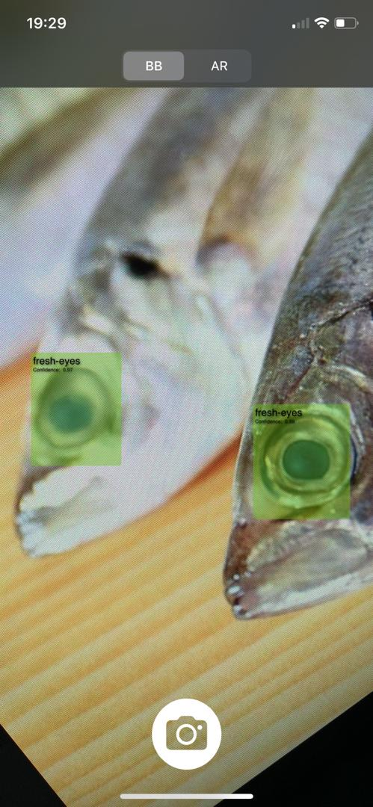
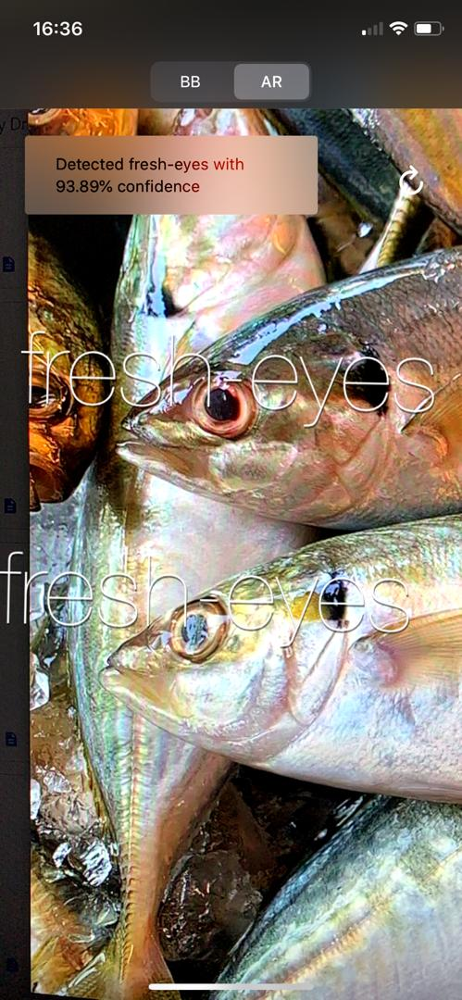

# fyp-effa-ios
A final year project by yours truly.
An intelligent camera app to check for fish's freshness using YOLOv3. Provides boundix box and augmented reality feature.
All rights reserved.

## Example:
Bounding Box
 

</a>

Augmented Reality
 

## Requirements:
- Apple Mac Computer
- XCode
- iOS device with iOS 13.+ version.

## Instruction:
- Choose a target device (with iOS 13.+)
- Click run to build the project.

** It is recommended that you clean the folder before build **
